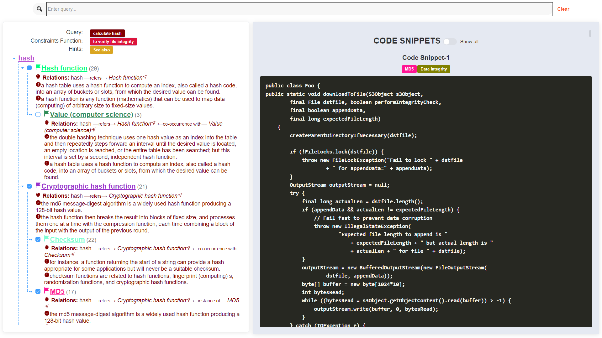
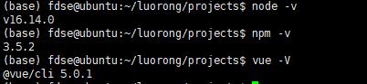
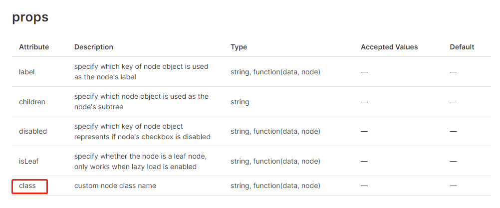
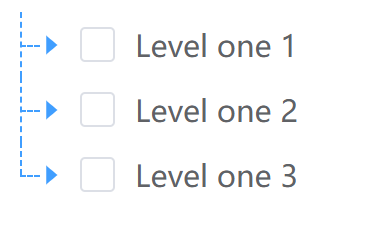

# Vue3 + Element3 学习过程简单记录

> 两周前，师兄要我完成一个前端的任务。因此我选择了较为熟悉的前端框架 Vue3 和配套的 UI 框架 ElementPlus，原型设计工具是 Figma。我最终实现的界面如下所示：
 
 

## 1. 简介

### 1.1 框架选择原因

#### (1) 选择 Vue3 的原因有如下几点：

- 方便搭建。依照官方给出的[安装教程](https://v3.cn.vuejs.org/guide/installation.html)，
- 上手简单。只需要会一些 JavaScript 等前端开发的基础知识。
- 轻量级。越简单越好，这是我们的项目需求使然。我们的目标是创建一个简单的前端搜索和展示页面，不需要进行页面之间的跳转。虽然像 Vue 这样的框架构建的网页本质上就是单页面，但实际上对于复杂项目来说，Vue 也需要进行许多代码的编写。

在可视化前端中，除了像 Vue 和 Angular 这样的前端框架之外，还有 D3 这种小巧的 js 库。由于我对 D3 不熟悉，所以我最终还是选择了 Vue。
由于 Vue3 相对 Vue2 来说更加新，所以 Vue3 的教程会相对来说少一些，面对一些 Error 什么的，还是不好弄。

#### (2) 选择 ElementPlus 的原因有如下几点：
- 和 Vue3 配套。
- 有许多方便使用的组件。
- 风格统一。

当然，Element 存在许多便捷的组件，这也意味着它的灵活性大大降低。我在开发的过程中，花费了 60% 的时间调整组件带给我的不灵活之处。

### 1.2 个人习惯

英文报错搜**谷歌**，谷歌搜不到就搜 ElementPlus 在 Github 的 **[issues](https://github.com/element-plus/element-plus/issues)**。除了本次项目我尝试使用 issues 来进行调试外，在使用很多其他开源项目时，如果我们碰到 BUG 或者一些安装方面的问题，我们都可以尝试去项目的 issues 部分进行查询或者直接提问。一般而言，生命力比较旺盛的开源项目都会有工作人员进行维护。在这里就不吐槽那些为了发论文所以开放项目地址但从不回应 issues 的人。

代码的基本写法搜**必应**，必应搜不到就转换成英文搜**谷歌**。鉴于我很长时间没有使用过 JavaScript 了，很多基本的数据结构的增删改查我不会使用，连循环都不会。中文版本的**菜鸟教程**和 **w3cschool** 以及少量的 CSDN 就可以满足我的需求。虽然我一直骂 CSDN 坑人，但我目前搜中文编程的一些基础资料还是会偶尔参考一下 CSDN。

### 1.3 前端原型

我师兄使用 **[Figma](https://www.figma.com/)** 画的原型。我师兄是个大佬，但是他很谦虚，认为自己是个小虾米。我根据他画的前端原型来进行前端的实现。在代码实现的过程中，如果需要修改需求，我们就会使用 Figma 对界面进行了微调，辅助我们进行需求的确认。

### 1.4 安装

#### (1) 准备

虽然安装不是重点，但是我想有必要补充一下我的安装过程，以免未来遗忘。

```shell
# 已经有 node。没有 Node.js 则需要先装 Node.js
sudo apt get npm  # 安装 npm
sudo npm install -g @vue/cli  # 安装 Vue3 的脚手架
```

由于原系统环境中安装了 Vue2 的脚手架，所以需要进行下述命令来重新安装 Vue3：

```bash
sudo npm cache clean -f
sudo npm install -g n
sudo n stable
sudo npm install -g @vue/cli
```

对于上面的命令，我想我有必要解释部分词汇。

首先，按照 [Node.js 官网](https://nodejs.org/en/) 的定义“Node.js® is a JavaScript runtime built on Chrome's V8 JavaScript engine. ” 用我师兄的话来说，Node.js 相当于为 JavaScript 提供了运行环境，类似于 Java 的 JVM。如果没有 Node.js，JavaScript 的运行必须依赖以 Chrome 内核为典型代表的浏览器引擎；有了 Node.js，开发人员不仅可以使用 JavaScript 来撰写前端，也可以使用 JavaScript 来撰写后端等，从而进行全栈开发。

其次，npm 是一个包管理工具，类似 Python 的 pip。

我的版本情况如下所示:


#### (2) 创建项目

```bash
vue create tool  # 创建名为 tool 的 Vue3 项目
cd tool  # 进入到新创建的 tool 项目中
npm install @element-plus/icons-vue  # 安装 element-plus
```

#### (3) 运行项目

我们运行 Vue 项目需要熟知如下三个命令:

```bash
npm install  # 安装 package.json 中罗列的包，文件夹下出现一个名为 node_moudule 的包，打开里面可以看到许多 JavaScript 和 TypeScript 代码
npm run serve  # 运行项目
npm run build  # 服务器部署所需
```


## 2. 必要的基础语言技能

前文已经述及，由于太久没有写过 HTML 等语言，我现在的相关技能已经退化至基本没有了，所以我进行必要的基础语言技能复建。

### 2.1 JavaScript

在 Vue3 中，JavaScript 代码被包裹在标签 `<script>` 中。

#### (1) 重要数据结构的基本方法

##### 1. [Array](https://www.w3school.com.cn/jsref/jsref_obj_array.asp)

```javascript
// 1. 初始化方法
let arr1 = new Array();
let arr2 = [];
let arr3 = [1, 2, 3];

// 2. 添加元素 - push
arr1.push(1);  // 一次性添加一个元素
arr1.push('aaa', 'bbb');  // 一次性添加多个元素

// 3. 取出元素 - pop
let lastItem = arr1.pop()

// 4. 合并两个 Array 0 concat
arr1 = arr1.concat(arr2)

// 5. 遍历
// 5.1. 传统 for 循环
for(var i = 0; i < arr.length; i++){ 
    console.log(arr[i]);
}

// 5.2 item 为当前元素，index 为下标
arr.forEach(function(item, index){ 
    console.log(item + '|' + index);
});

// 5.3 增强 for 循环，i 为下标
for(let i in arr){ 
    console.log(arr[i]);
}

for(let item of arr){ 
    console.log(item);
}

// 在 for 循环中，in 会找出 arr 的下标，of 会找出 arr 的所有元素。对于不可遍历的元素，就只能使用 in。
```

##### 2. [Dictionary](https://pietschsoft.com/post/2015/09/05/javascript-basics-how-to-create-a-dictionary-with-keyvalue-pairs)

```javascript
// 1. 初始化方法
let dict = new Object();
let dict = {};

// 2. 添加元素
dict["one"] = 1;

// 3. 遍历
for(let key in dict) {
  let value = dict[key];
  // do something with "key" and "value" variables
}

// 4. 函数也可以是 key 或者 value，我觉得这个功能应该很好玩，但我还没试过。
let sleep = function() {
  console.log('Let us sleep!')
}
dict['rest'] = sleep
dict.rest()

```

##### 3. [Set](https://www.w3school.com.cn/js/js_object_sets.asp)
```javascript
// 1. 初始化方法
let set = new Set()

// 2. 添加元素 - add
set.add(1)

```

##### 4. [Map](https://www.w3school.com.cn/js/js_object_maps.asp)

```javascript
// 暂时没有使用过，不做评价
```

#### (2) 代码调试小技巧

当有不确定的代码时，可以先**在浏览器的控制台直接输入代码**，查看其效果。这样比较方便调试。

#### (3) JavaScript 动态生成 CSS

以一段项目中的代码为例：

```javascript
addCSS(className, colorValue) {
  let dotClassName = '.' + className
  let colorAttribute = 'color: ' + colorValue + ';'
  let style = document.createElement('style');
  document.getElementsByTagName('head')[0].appendChild(style);
  if(!(style.sheet||{}).insertRule) 
    (style.styleSheet || style.sheet).addRule(dotClassName, colorAttribute);
  else
    style.sheet.insertRule(dotClassName + "{" + colorAttribute + "}",0);  
},
```

使用 `document.getElementsByTagName('head')` 获取页面中的 `head` 元素，然后在其后添加包含 CSS 代码的子节点。

### 2.2 CSS

在 Vue3 中，CSS 代码被包裹在标签 `<style>` 中。

使用选择器获取页面元素。

#### [选择器](https://www.w3school.com.cn/css/css_selectors.asp)

- 元素选择器根据元素名称来选择 HTML 元素。`p`
- id 选择器使用 HTML 元素的 id 属性来选择特定元素。`#id`
- 类选择器选择有特定 class 属性的 HTML 元素。`.classname`
- 通用选择器（*）选择页面上的所有的 HTML 元素。`*`
- 分组选择器选取所有具有相同样式定义的 HTML 元素。`p, h1, h2`

上述选择器是基础用法，我们可以使用逻辑组合伪类。比如元素的最后一个节点：`p:last-child`。类似的用法可以在用到的时候进行查询。

### 2.3 HTML

在 Vue3 中，HTML 代码被包裹在标签 `<template>` 中。

## 3. 常见问题及解决方式

### 3.1 不同组件传值

#### (1) 子组件向父组件传值: **emit**

`App.vue`
```vue
<template>
<h1>{{ title }}</h1>
<Child @childVariableName="parentMethod($event)" />
</template>

<script>
  import Child from "./components/Child"
  export default{
    name:'App',
    components: {
      Child,
    },
    data()
    {
      return{
        title:'Old Title'
      }
    },
    methods:{
      parentMethod(title)
      {
        this.title = title;
      },
    }
</script>

<style>
</style>
```

`Child.vue `
```vue
<template lang="html">
  <button type="button" @click='childMethod'> Update me </button>
</template>

<script>
export default {
  name:'Child',
  methods:{
    childMethod()
    {
      this.$emit('childVariableName', 'New Title')
    }
  }
}
</script>

<style scoped>
</style>
```


#### (2) 子组件向父组件传递多个值

将 `App.vue` 中的 `<Child @childVariableName="parentMethod($event)" />` 改为 `<Child @childVariableName="parentMethod" />`，将 `Child.vue` 中的 `this.$emit('childVariableName', 'New Title')` 改为 `this.$emit('changeTitle', data1, data2, ...)`

#### (3) 父组件向子组件传值: Props

`Parent.vue`

```vue
<template>
<h1>{{ title }}</h1>
<Child childValue="This is parent value" />
</template>

<script>
  import Child from "./components/Child"
  export default{
    name:'Parent',
    components: {
      Child,
    },
    data()
    {
      return{
        parentValue: 'Parent Value'
      }
    }
</script>
```

`Child.vue`

```vue
<template lang="html">
  {{ childValue }}
</template>

<script>
export default {
  name:'Child',
  props: ['childValue']
}
</script>

```

如果所传的值是个变量，需要在变量前加冒号 `:`

`Parent.vue`

```vue
<template>
<h1>{{ title }}</h1>
<Child :childValue="parentValue" />
</template>

<script>
  import Child from "./components/Child"
  export default{
    name:'Parent',
    components: {
      Child,
    },
    data()
    {
      return{
        parentValue: 'Parent Value'
      }
    }
</script>
```

`Child.vue`

```vue
<template lang="html">
  {{ childValue }}
</template>

<script>
export default {
  name:'Child',
  props: ['childValue']
}
</script>

```

通过 props 从父节点传递到子节点的数据值是不可更改的，因此如果想要对该数值进行修改等操作，需要通过重新定义一个新的变量来复制该数据，进而对新变量进行操作。

`Child.vue`

```vue
<template lang="html">
  {{ childValue }}
</template>

<script>
export default {
  name:'Child',
  props: ['childValue'],
  data() {
    return {
      copiedChildValue: childValue
    }
  },
  methods: {
    updateValue(newValue) {
      this.copiedChildValue = newValue
    }
  }
}
</script>

```

#### (4) 父子组件之间值的动态变化

当子组件构建完毕后，父组件传递的值发生了变化，此时子组件是不会发生变化的。为了能让子组件相应父组件的变化，我们必须借助生命周期函数 `watch` 来监视该变量的变化。

`Parent.vue`

```vue
<template>
<h1>{{ title }}</h1>
<Child :childValue="parentValue" />
</template>

<script>
  import Child from "./components/Child"
  export default{
    name:'Parent',
    components: {
      Child,
    },
    data() {
      return{
        parentValue: 'Parent Value'
      }
    }
</script>
```

`Child.vue`

```vue
<template v-if='showValue'>
  {{ childValue }}
</template>

<script>
export default {
  name:'Child',
  props: ['childValue'],
  data() {
    return{
      parentValue: 'Parent Value',
      showValue: false,
    }
  }
  watch: {
    // 被监听的对象
    childValue: {
      immediate: true,      
      handler (newValue) {
        // 销毁当前组件
        this.showValue = false
        this.$nextTick(() => {
          this.parentValue = newValue
          this.showValue = true
        })
      }
    }
  }
}
</script>

```

#### (5) 非父子节点传值

我的做法是在两个组件的共同父组件中进行数值的转发。这样做的原因是这两个节点属于兄弟节点，它们的关系比较密切。实际上还有其他的官方发布的[非父子组件间的传值方案](https://zhuanlan.zhihu.com/p/51001131)。

目前还没有尝试过。

### 3.2 钩子函数
#### 关于 computed、methods、watch，mounted

区别见[此处链接](https://www.cnblogs.com/binmengxue/p/9958174.html)

1. computed是在HTML DOM加载后马上执行的，如赋值；
2. methods则必须要有一定的触发条件才能执行，如点击事件；
3. watch呢？它用于观察Vue实例上的数据变动。对应一个对象，键是观察表达式，值是对应回调。值也可以是方法名，或者是对象，包含选项。所以他们的执行顺序为：默认加载的时候先computed再watch，不执行methods；等触发某一事件后，则是：先methods再watch。
4. mounted 是生命周期
5. created和mounted区别？

#### watch 同时监听多个值

首先使用 computed 定义一个复合对象吧，然后再对该对象进行 watch。

```javascript
export default {
  ...,
  computed: {
    propsVariables() {
      const { val1, val2 } = this
      return {
        vall1,
        val2
      }
    }
  },

  watch: {
    propsVariables: {
      immediate: true,
      deep: true,
      handler (newValue) {
        console.log(newValue.val1, newValue.val2)
      }
    },
  }
}
```

### 3.3 ElementPlus 组件的属性、方法、事件、插槽及样式修改

这一部分可以重点关注官方文档。由于我在此次项目中重点使用了 [Vue3 的树](https://element-plus.gitee.io/zh-CN/component/tree.html)，所以我以对 Vue3 的树进行样式修改为例。

#### (1) 属性

属性是指在 element 组件的基础上，在其元素上添加给定的属性，以提高其灵活性。

Tree 组件的属性节选如下：


在构建树的时候，我们可以直接将常量或变量复制给特定的属性。
在下面的代码中，我给 Tree 组件传进去了包括 `data`、`empty-text`、`show-checkbox` 等值。

```vue
<template>
  <div>
    <div class="grid-content" style="text-align: left">
      <el-tree
        v-if="showReady"
        :data="[treeHierarchy]"
        :ref="treeName"
        empty-text='No Results'
        show-checkbox
        node-key="id"
        indent="25"
        default-expand-all
        :default-checked-keys='[rootId]'
        :props="{
                  children: 'children',
                  label: 'name',
                  class: customNodeClass,
                }"
        @check-change="handleCheckChange"
      >
        <template v-slot:default="{ node }">
        <div class="custom-node" style='word-wrap:break-word;' >
              <!-- content -->
              {{ node.label }}
        </template>

      </el-tree>
    </div>
  </div>
</template>

```


#### (2) 方法

Tree 组件的方法节选如下：


在使用 Tree 组件的时候，我们需要先获取 Tree 组件，在下面的代码里，我通过 ref 属性给 Tree 组件添加了一个名字，在 `methods` 中添加了一行代码 `let retNodes = this.$refs['treename'].getCheckedNodes()` 以获取当前选中的节点数组。之所以可以调用 getCheckedNodes() 方法是因为在文档中清晰地告知了可以使用该方法。但是我一开始没有看明白文档中方法的使用方式，所以在查找资料上花费了很多时间。

```vue
<template>
  <el-tree
    :data="data"
    show-checkbox
    ref='treename'
    node-key="id"
    :default-expanded-keys="[2, 3]"
    :default-checked-keys="[5]"
    :props="defaultProps"
  />
</template>

<script lang="ts" setup>
  const defaultProps = {
    children: 'children',
    label: 'label',
  }
  const data = [
    {
      id: 1,
      label: 'Level one 1',
      children: [
        {
          id: 4,
          label: 'Level two 1-1',
          children: [
            {
              id: 9,
              label: 'Level three 1-1-1',
            },
            {
              id: 10,
              label: 'Level three 1-1-2',
            },
          ],
        },
      ],
    },
    {
      id: 2,
      label: 'Level one 2',
      children: [
        {
          id: 5,
          label: 'Level two 2-1',
        },
        {
          id: 6,
          label: 'Level two 2-2',
        },
      ],
    },
    {
      id: 3,
      label: 'Level one 3',
      children: [
        {
          id: 7,
          label: 'Level two 3-1',
        },
        {
          id: 8,
          label: 'Level two 3-2',
        },
      ],
    },
  ]
  
  export default: {
    methods: {
      test() {
        let retNodes = this.$refs['treename'].getCheckedNodes()
        console.log(retNodes)
      }
    }
  }
</script>
```

#### (3) 事件

Tree 组件的事情节选如下：


回调参数的意思是，如果我们调用事件，那我们就可以获得 Tree 组件包装的函数的返回值。以 check-change 函数为例，我们自定义一个函数 handleCheckChange，当复选框被点击的时候，handleCheckChange 函数就会被执行。

```vue
<template>
  <el-tree
    :data="data"
    show-checkbox
    ref='treename'
    node-key="id"
    :default-expanded-keys="[2, 3]"
    :default-checked-keys="[5]"
    :props="defaultProps"
    @check-change="handleCheckChange"
  />
</template>

<script lang="ts" setup>
  const defaultProps = {
    children: 'children',
    label: 'label',
  }
  const data = [
    {
      id: 1,
      label: 'Level one 1',
      children: [
        {
          id: 4,
          label: 'Level two 1-1',
          children: [
            {
              id: 9,
              label: 'Level three 1-1-1',
            },
            {
              id: 10,
              label: 'Level three 1-1-2',
            },
          ],
        },
      ],
    },
    {
      id: 2,
      label: 'Level one 2',
      children: [
        {
          id: 5,
          label: 'Level two 2-1',
        },
        {
          id: 6,
          label: 'Level two 2-2',
        },
      ],
    },
    {
      id: 3,
      label: 'Level one 3',
      children: [
        {
          id: 7,
          label: 'Level two 3-1',
        },
        {
          id: 8,
          label: 'Level two 3-2',
        },
      ],
    },
  ]
  
  export default: {
    methods: {
      handleCheckChange(data1, data2) {
        console.log(data1, data2)
      }
    }
  }
</script>
```

#### (4) 插槽

ElementPlus 的插槽。仍旧以 Tree 组件为例，我想要修改树上每个节点的内容，那我就可以通过插槽对其样式进行修改。下面我决定将节点上的字变为红色。当然，我们也可以在 slot 中添加图标或任何其他想要的内容。

```html
<el-tree
  v-if="showReady"
  :data="[treeHierarchy]"
  :ref="treeName"
  show-checkbox
  node-key="id"
  default-expand-all
  :default-checked-keys='[rootId]'
  :props="{
            children: 'children',
            label: 'name',
            class: customNodeClass,
          }"
  @check-change="handleCheckChange"
>
  <template v-slot:default="{ node }">
  <!-- <template #default="scope"> -->
    <element-tree-line
      :node="node"
      :showLabelLine="true"
      indent="25"
    >
      <div class="custom-node" style='word-wrap:break-word;' >
        <!-- content -->
        <span color='red'>{{ node.label }}</span>
      </div>
    </element-tree-line>
  </template>

</el-tree>
```

`v-slot` 就是我们放进去的插槽。其实，`v-slot` 是 Vue2 的写法，Vue3 的新写法是 `<template #default="scope">`。

#### (5) CSS 修改

对于给定的组件，我们经常需要对其进行修改。因为官方的组件虽然做了很多基础的工作，但也给了很多限制。对 CSS 的样式进行修改这一部分内容我们需要知晓如下两种情况。

##### 1. CSS 添加 class

以 Tree 组件为例，我在 props 里为其添加了 class。



在 class 中，如果有 `no-check-node`，节点就不会显示复选框。

```vue
<template>
  <div class="grid-content" style="text-align: left">
    <el-tree
      :data="[treeHierarchy]"
      :ref="treeName"
      empty-text='No Results'
      show-checkbox
      node-key="id"
      default-expand-all
      :default-checked-keys='[rootId]'
      :props="{
                children: 'children',
                label: 'name',
                class: customNodeClass,
              }"
      @check-change="handleCheckChange"
    />
  </div>
</template>

<script>

// 给节点添加class
const customNodeClass = (data) => {
  let ret = data.colorClass
  // 针对描述型的节点不显示其复选框
  if (undefined === nodeType || nodeType !== 'Notion') {
    ret += ' no-checkbox-node';
  }
  return ret;
};

export default {
  name: 'MyTree',
  components: { ElementTreeLine: getElementLabelLine(h) },
  props: {
    'treeHierarchy': {
      require: true
    },
    'treeName': {
      require: true
    },
    'rootId': {
      require: true
    }, 
  },
  data() {
    return {
      customNodeClass,
    }
  },
</script>
```

除了借助已有的 class 外，我们也可以自己新建 class，添加至 HTML 元素上，然后编写 CSS 代码对元素的表现形式进行控制。

##### 2. less 和 sass

在查找 Vue3 和 ElementPlus 的资料时，搜索引擎给了我许多 Vue2 和 ElementUI 的资料，有一部分不可以使用在新版本上，但是还有一部分是可以类推到新版本上。其中，许多样式的修改使用到了 `less`。使用 `less` 之前需要先下载 `less-loader` 。

```bash
npm install --save-dev less-loader less
```

在开发完成后，我们需要将 less 代码转换为 CSS。

> 首先sass和less都是css的预编译处理语言，他们引入了mixins，参数，嵌套规则，运算，颜色，名字空间，作用域，JavaScript赋值等 加快了css开发效率,当然这两者都可以配合gulp和grunt等前端构建工具使用
> 
> sass和less主要区别:在于实现方式 less是基于JavaScript的在客户端处理 所以安装的时候用npm，sass是基于ruby所以在服务器处理。
> 
> 很多开发者不会选择LESS因为JavaScript引擎需要额外的时间来处理代码然后输出修改过的CSS到浏览器。关于这个有很多种方式，我选择的是只在开发环节使用LESS。一旦我完成了开发，我就复制然后粘贴LESS输出的到一个压缩器，然后到一个单独的CSS文件来替代LESS文件。另一个选择是使用LESS.app来编译和压缩你的LESS文件。两个选择都将最小化你的样式输出，从而避免由于用户的浏览器不支持JavaScript而可能引起的任何问题。尽管这不大可能，但终归是有可能的。
> 摘自 [LESS与SASS的区别](https://www.jianshu.com/p/e3f1fcbbccc3)


### 3.4 工具

#### 前端展示的代码高亮工具

选择了 `Prism.js`。详细解释见如下两个链接：[Prism.js 官网链接](http://prismjs.com/index.html)、[Prism.js 简单使用文档](https://segmentfault.com/a/1190000009122617)

```bash
todo: 如何下载
```

```javascript

<template>
  <pre class="language-java"><code class="language-java"><b>{{ code }}</b></code></pre>
<template>

<style>
import Prism from "prismjs";
Prism.highlightAll()
</style>
```
### 3.5 报错与特定功能实现

#### (1) Vue3 文件导入 JavaScript 文件的值

```javascript
import { importedVariable } from 'data'
```

千万不可以少两个花括号 `import variable from 'data'`，不然无法识别。

上面的代码生效的前提是，只有在 `data.js` 中有默认导出的 `export default` 语法时才会生效。也就是说，`data.js` 中有如下代码:

```javascript
let importedVariable = 'importedVariable'
export default {
  importedVariable
}
```

#### (2) `export default` 和 `export` 的区别

##### 作用

export 和 export default 实现的功能相同，即：可用于导出（暴露）常量、函数、文件、模块等，以便其他文件调用。

##### 区别

1、export 导出多个对象，export default 只能导出一个对象

2、export 导出对象需要用 { }，export default 不需要 { }，如：

export { A,B,C };

export default A;

3、在其他文件引用 export default 导出的对象时不一定使用导出时的名字。因为这种方式实际上是将该导出对象设置为默认导出对象，如：

假设文件 A、B 在同级目录，实现文件 B 引入文件 A 的导出对象 deObject：

文件 A：export default deObject

文件 B：import deObject from './A'

或者：

import newDeObject from './A'

#### (3) Vue3 无法正常显示图标 el-icon

我首先通过 npm 全局导入 element-icon（[icon 导入方式](https://element-plus.org/en-US/component/icon.html#using-packaging-manager)），运行命令 `npm install @element-plus/icons-vue` ，图标不显示。
随后我尝试将 icon 组件导入需要使用该 icon 的文件，图标仍然不显示。
最后我将图标的 svg 复制下来，最终才正常显示 el-icon。

在 [icon 的代码复制界面](https://element-plus.org/en-US/component/icon.html#icon-collection) 选择“Copy svg content”，即可复制该代码的 svg 值，随后我们将其复制在我们需要的 HTML 代码中。

#### (4) Vue3 不显示 element-tree 

原因一：
在 `<style>` 下使用了 methods 中的方法，导致找不到方法，所以 el-tree 无法显示。

原因二：传进去的 data 不是 list
报错： `Uncaught (in promise) TypeError: children.indexOf is not a function`。
解决方法：在传入的 data 中添加一个 [] 

#### (5) Vue3 文件中定义了两个同名全局变量
报错：`error Duplicated key`，详见[解释](https://eslint.vuejs.org/rules/no-dupe-keys.html)。
解决方法：将两个同名变量修改为不同名称。


#### (6) 设置全部节点默认选中
实际上仅需设置选中根节点。

```vue
:default-checked-keys='[rootId]'
```

在 Tree 组件中添加属性 `default-checked-keys`，`rootId` 是一个变量，表示根节点。

#### (7) 控制链接的大小和颜色

```css
a{
  color: inherit;  /* 继承父节点的颜色 */ 
}
a:link, a:visited{
  text-decoration: none;  /*超链接无下划线*/
}
a:hover{
  text-decoration: underline;  /*鼠标放上去有下划线*/
}
```

#### (8) 在 Tree 组件上添加虚线

安装网友写的[插件](https://npm.io/package/element-plus-tree-line) `element-tree-line`。

```vue
<template>
    <el-tree
        :data="data"
        show-checkbox
        node-key="id"
        draggable
        :default-expanded-keys="[2, 3]"
        :default-checked-keys="[5]"
        :props="defaultProps"
        :indent="treeIndent"
        ><template v-slot:default="{ node }">
            <element-tree-line
                :node="node"
                :indent="treeIndent"
            >
                <template v-slot:node-label>
                    <span style="font-size: 12px">
                        {{ node.label }}
                    </span>
                </template>
            </element-tree-line>
        </template>
    </el-tree>
</template>
<script>
    import { getElementLabelLine } from 'element-tree-line';
    import 'element-tree-line/dist/style.css';
    import { h } from 'vue';
    export default {
        name: 'App',
        components: { ElementTreeLine: getElementLabelLine(h) },
        data() {
            return {
                treeIndent: 30,
                data: [
                    {
                        id: 1,
                        label: 'Level one 1',
                        children: [
                            {
                                id: 4,
                                label: 'Level two 1-1',
                                children: [
                                    {
                                        id: 9,
                                        label: 'Level three 1-1-1',
                                    },
                                    {
                                        id: 10,
                                        label: 'Level three 1-1-2',
                                    },
                                ],
                            },
                        ],
                    },
                    {
                        id: 2,
                        label: 'Level one 2',
                        children: [
                            {
                                id: 5,
                                label: 'Level two 2-1',
                            },
                            {
                                id: 6,
                                label: 'Level two 2-2',
                            },
                        ],
                    },
                    {
                        id: 3,
                        label: 'Level one 3',
                        children: [
                            {
                                id: 7,
                                label: 'Level two 3-1',
                            },
                            {
                                id: 8,
                                label: 'Level two 3-2',
                            },
                        ],
                    },
                ],
                defaultProps: {
                    children: 'children',
                    label: 'label',
                },
            };
        },
    };
</script>
<style>
.element-tree-node-line-hor {
  border-bottom: 1px dashed #409eff;
}
.element-tree-node-line-ver {
  border-left: 1px dashed #409eff;
}
.element-tree-node-line-ver.last-node-line {
  border-left: 1px dashed transparent;
}
.element-tree-node-line-ver.last-node-isLeaf-line {
  height: 50%;
}
.element-tree-node-label-line {
  border: 0px;
}
.el-tree-node__expand-icon {
  color: #409eff
}
</style>

```

上述代码效果图如下：



#### (9) 元素和页面一样高

使用 `height='100vh'`。


> 创建于 2022 年 3 月 21 日

> 更新于 2022 年 3 月 22 日
