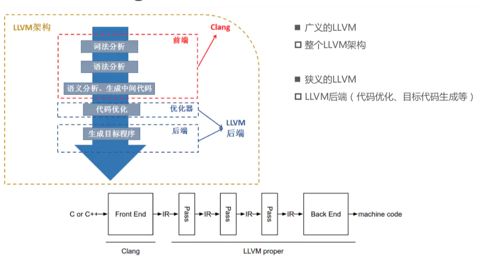

# 静态程序分析工具 Antlr 简介

## 一、简介及展示

#### Antlr 简介

**ANTLR** (ANother Tool for Language Recognition) is a powerful **parser generator** for reading, processing, executing, or translating structured text or binary files. It's widely used to build languages, tools, and frameworks. From a **grammar**, ANTLR generates a **parser** that can build and walk **parse tree**s.（见 [https://www.antlr.org/index.html](https://www.antlr.org/index.html)）

最新版本 4.9.3（截止至 2021年12月1日，见 [https://www.antlr.org/download.html](https://www.antlr.org/download.html)），可以解析如下程序设计语言:

- Java
- C# (and an alternate C# target)


- Python (2 and 3)
- JavaScript


- Go
- C++


- Swift
- PHP


- DART

针对上述每一种程序设计语言，Antlr 提供相应的 grammar lexicon。

#### Antlr 使用展示

使用 Antlr 进行程序分析。

代码文件 `test.cpp` 如下所示：

```c++
int addOne(int x);
int ten();

int main() {
	int a, b, c;
	a = 6;
	b = addOne(a);
	c = b - 3;
	b = ten();
	c = a * b;
}

int addOne(int x) {
	int y = x + 1;
	return y;
}
int ten() {
	return 10;
}
```

 `test.cpp` 的 AST 如下图所示：


以该代码文件的第一行 `int addOne(int x);` 为例，其子树如下图所示：


从叶子节点来看，Antlr 将代码 `int addOne(int x);` 成功解析出来了。

#### Antlr 开发流程

一般开发流程如下：

1. 定义 .g4 **语法文件**；
2. 使用 ANTLR4 生成**词法分析器**（Lexer）和**语法分析器**（Parser）目标编程语言代码；


1. 遍历 **AST**（Abstract Syntax Tree 抽象语法树），ANTLR 4 支持两种模式：访问者模式（Visitor）和监听器模式（Listener）。

#### 本文总览

Antlr 简介 👉 静态程序分析（Antlr 存在的意义） 👉 编译（AST 在编译中的位置） 👉 AST 简介 👉 grammar lexicon（如何使用 Antlr 生成可使用的代码） 👉 AST 的遍历方式（Antlr 提供的遍历方式） 👉 使用 Antlr 的应用 👉 和 Antlr 对标的静态程序工具

## 二、程序分析

什么是程序分析？是指在**不运行代码**的方式下，通过**词法分析**、**语法分析**、**控制流分析**、**数据流分析**等技术对程序代码进行扫描，验证代码是否满足规范性、安全性、可靠性、可维护性等指标的一种代码分析技术。目前静态分析技术向模拟执行的技术发展以能够发现更多传统意义上动态测试才能发现的缺陷，例如符号执行、抽象解释、值依赖分析等等并采用数学约束求解工具进行路径约减或者可达性分析以减少误报增加效率。（摘自 [https://www.jianshu.com/p/aeb15d28eb39](https://www.jianshu.com/p/aeb15d28eb39)）

简单来说，**程序分析**就是“我想在不运行一个程序的情况下，通过某种方法分析该程序就知道其是否满足某些性质”。这种“不运行程序”的状态也称为“静态”或“编译时（compile-time）”，与程序的“动态”和“运行时（run-time）”相对应），这种分析方法也被叫作**静态程序分析**或**静态分析**。（摘自 [https://zhuanlan.zhihu.com/p/417187798](https://zhuanlan.zhihu.com/p/417187798)）

做静态程序分析必须提供一个编译器前端来将源代码转成中间代码，那为何不直接在源代码上做静态程序分析呢？原因是静态程序分析一般不是用来分析 trivial 错误的工具，而是分析 non-trivial 错误的。什么是 trivial 的错误？例如拼写错误，语法错误等一些可以被编译器前端处理的错误，non-trivial 就是一些与运行时相关的错误，例如除零错误等。（摘自  [https://zhuanlan.zhihu.com/p/129361229](https://zhuanlan.zhihu.com/p/129361229) ）

#### 为什么要进行静态程序分析？

- 在执行代码之前获取代码洞见；
- 与动态分析相比，执行速度更快；


- 可以对代码质量维护进行自动化；
- 在早期阶段 (尽管不是所有阶段) 可以自动检索 bug；


- 在早期阶段可以自动发现安全问题；
- 如果你在使用带有静态分析器的 IDE(例如遵循 PEP8 的 Pycharm)，那你已经在“船”上了。

（摘自 [https://www.infoq.cn/article/W0dQwY4dWzXyIxBaxl5D](https://www.infoq.cn/article/W0dQwY4dWzXyIxBaxl5D)）

## 三、编译原理回顾


（图源龙书第二版）


（图源自 [https://pascal-group.bitbucket.io/teaching.html](https://pascal-group.bitbucket.io/teaching.html) IR.pdf）


## 四、AST

**抽象语法树**（abstract syntax code，AST）**是源代码的抽象语法结构的树状表示**，树上的每个节点都表示源代码中的一种结构，之所以说是抽象的，**抽象表示把代码进行了结构化的转化**，转化为一种数据结构。这种数据结构其实就是一个大的 json 对象，就像一颗枝繁叶茂的树。简单理解，就是把我们写的代码按照一定的规则转换成一种树形结构。

**抽象语法树**是程序源代码结构的树状表示。程序源代码经过词法分析器（Lexer）得到各种不同种类的单词（Token），再由语法分析器（Parser）分析和语法检查后得到抽象语法树(AST)。抽象语法树的根节点表示整个程序，内部节点是抽象语法结构或者单词。AST的核心在于它能与输入源代码中的各个语法元素一一对应。

## 五、Grammar Lexicon

grammar lexicon 包括 lexer 和 parser 两部分。

Antlr 官方提供许多已经写好的 grammar lexicon，见 [https://github.com/antlr/grammars-v4](https://github.com/antlr/grammars-v4)。

语法解析器是传统解析器重要组件，语法解析器工作流程包括词法分析和语法分析两个阶段。

### Lexer

定义：lexer 主要负责将符号文本分组成符号类tokens，把输入的文本转换成词法符号的程序称为词法分析器(lexer)。词法单元和词法规则通常以大写字母命名。

举例：节选自 `CPP14Lexer.g4` 

```shell
IntegerLiteral:
	DecimalLiteral Integersuffix?
	| OctalLiteral Integersuffix?
	| HexadecimalLiteral Integersuffix?
	| BinaryLiteral Integersuffix?;

CharacterLiteral:
	('u' | 'U' | 'L')? '\'' Cchar+ '\'';

FloatingLiteral:
	Fractionalconstant Exponentpart? Floatingsuffix?
	| Digitsequence Exponentpart Floatingsuffix?;

Plus: '+';
Minus: '-';
Star: '*';
Div: '/';

Whitespace: [ \t]+ -> skip;
Newline: ('\r' '\n'? | '\n') -> skip;
BlockComment: '/*' .*? '*/' -> skip;
LineComment: '//' ~ [\r\n]* -> skip;
```

### Parser

定义：parser 的目标就是构建一个语法解析树。语法解析的输入是tokens，输出就是一颗语法解析树。解析规则以小写字母开头命名(驼峰命名法)

举例：节选自 `CPP14Parser.g4` 

```
noPointerDeclarator:
	declaratorid attributeSpecifierSeq?
	| noPointerDeclarator (
		parametersAndQualifiers
		| LeftBracket constantExpression? RightBracket attributeSpecifierSeq?
	)
	| LeftParen pointerDeclarator RightParen;

parametersAndQualifiers:
	LeftParen parameterDeclarationClause? RightParen cvqualifierseq? refqualifier?
		exceptionSpecification? attributeSpecifierSeq?;

```


### Grammar Lexcon 的用途

Antlr 通过 grammar lexicon 生成可个性化定制的 Java 代码文件。


（图源自《Antlr权威指南》59页）

grammar lexicon 中的每一个不被 skip 的 rule 都会被 Antlr 转换为一个节点。

#### AST 中节点在代码文件中的表现形式举例

例一：以上图中的 ArrayInit.g4 为例，在 `ArrayInitBaseListener.java`  和 `ArrayInitBaseVisitor.java`文件中，parser rule `init` 和 `value`，以及 lexer rule `INT` 会生成响应的节点监听或节点访问方法。

例二：以 C++14 中的 `noPointerDeclarator` 节点为例（访问模式）：

```java
@Override
public String visitNoPointerDeclarator(CPP14Parser.NoPointerDeclaratorContext ctx) {
  // 注：下列注释是 CPP14Parser.g4 文件中定义的 parser rule 生成的节点。
  // noPointerDeclarator:
  //     declaratorid attributeSpecifierSeq?
  //     | noPointerDeclarator (
  //         parametersAndQualifiers
  //         | LeftBracket constantExpression? RightBracket attributeSpecifierSeq?
  //     )
  //     | LeftParen pointerDeclarator RightParen;

  String noPointerDeclaratorString = "";
  // 注：这是 noPointerDeclarator 节点的子节点的第一种情况，问号表示该节点存在一次或者两次。
  // case 1: declaratorid attributeSpecifierSeq?
  if (ctx.declaratorid() != null) {
    noPointerDeclaratorString += visit(ctx.declaratorid());
  }
  // 注：这是 noPointerDeclarator 节点的子节点的第三种情况。之所以把这种情况提前，是因为第二种情况比较复杂。
  // case 3: LeftParen pointerDeclarator RightParen
  else if (ctx.pointerDeclarator() != null) {
    ...
  }
  // 注：这是 noPointerDeclarator 节点的子节点的第二种情况。这种情况下，noPointerDeclarator 作为子节点是一定存在的，而其余的节点可能存在，也可能不存在，所以就接着分情况继续讨论。
  // case 2: noPointerDeclarator
  else {  //  ctx.noPointerDeclarator() != null            
    // case 2.1: noPointerDeclarator parametersAndQualifiers
    if (ctx.parametersAndQualifiers() != null) {
      ...
      // parameters and their qualifiers
      noPointerDeclaratorString += visit(ctx.parametersAndQualifiers());
    }
    // case 2.2: noPointerDeclarator LeftBracket constantExpression? RightBracket attributeSpecifierSeq?
    else if (ctx.LeftBracket() != null) {
      ...
      noPointerDeclaratorString += visit(ctx.noPointerDeclarator());  // return the name of param/field/variable
    }
    // case 2.0: noPointerDeclarator
    else {
      noPointerDeclaratorString += visitChildren(ctx);
    }
  } 

  return noPointerDeclaratorString;
}
```

### 通用规则

- grammar 名称和文件名要一致
- Parser 规则（即 non-terminal）以小写字母开始


- Lexer 规则（即 terminal）以大写字母开始
- 所有的 Lexer 规则无论写在哪里都会被重排到 Parser 规则之后


- 所有规则中若有冲突，先出现的规则优先匹配
- 用 'string' 单引号引出字符串


- | 用于分隔两个产生式，(a|b) 括号用于指定子产生式，?+*用法同正则表达式
- 在产生式后面 # label 可以给某条产生式命名，在生成的代码中即可根据标签分辨不同产生式


- 不需要指定开始符号
- 规则以分号终结


- /* block comment */ 以及 // line comment
- 默认的左结合，可以用 <assoc=right> 指定右结合


- 可以处理直接的左递归，不能处理间接的左递归
- 如果用 MUL: '*'; 指定了某个字符串的名字，在程序里面就能用这个名字了


- 用 fragment 可以给 Lexer 规则中的公共部分命名

## 六、遍历模式

### listener 模式


```java
/**
 * 以节点 noPointerDeclarator 为例的 Listener 模式
 * 如果 AST 中存在 noPointerDeclarator，那么 Listener 首先会自动触发 enter 函数，继而遍历其子树，遍历 * 完毕后再执行 exit 函数。
*/
@Override public void enterNoPointerDeclarator(CPP14Parser.NoPointerDeclaratorContext ctx) {
    ...
}

@Override public void exitNoPointerDeclarator(CPP14Parser.NoPointerDeclaratorContext ctx) {
    ...
}
```

### visitor 模式


```java
/** 
 * 以节点 NoPointerDeclarator 为例的 Visitor 模式 
 * 该方法被其父节点调用时才会执行。
 */
@Override public T visitNoPointerDeclarator(CPP14Parser.NoPointerDeclaratorContext ctx) { 
    return visitChildren(ctx); 
}
```

### 两种模式的区别

- Listener 模式会由 ANTLR 提供的 walker 对象自动调用，每一个节点都会被遍历到，对于非叶子节点会有两个函数，分别是 enter 和 exist；而 Visitor 模式则必须通过显式的访问调用遍历其子节点，如果忘记在节点的子节点上调用 visit()，意味着这些子树不会被访问；
- Listener 模式不能返回值，其返回节点为 void；而 Visitor 模式可以返回任何自定义类型，其抽象类的返回值为 T，子类可以通过继承自定义返回值。 因此，Listener模式就只能用一些变量来存储中间值，而 Visitor 可以直接返回计算值；


- Listener 模式使用分配在堆上的显式堆栈，而 Visitor 模式使用调用堆栈来管理树遍历，在深度嵌套的 AST 上使用访客时，这可能会导致 StackOverFlow 异常。（不是很确定，因为我目前接触到的 AST 最高不过百层）

## 七、Antlr 的应用

### Presto

**查询引擎 presto 就是用的 antlr 做底层 sql 语法解析。**

对于SQL语言，ANTLR的应用广度和深度会更大，这是由于Hive, Presto, SparkSQL等由于需要对SQL的执行进行定制化开发，比如实现分布式查询引擎、实现各种大数据场景下独有的特性等。（摘自 [https://segmentfault.com/a/1190000040490309?sort=newest](https://segmentfault.com/a/1190000040490309?sort=newest)）

### CheckStyle

**在构建特定语言的 AST 方面，CheckStyle 工具，就是基于 Antlr 来解析 Java 的语法结构的。**

（源代码见 [https://github.com/checkstyle/checkstyle](https://github.com/checkstyle/checkstyle) ）

**CheckStyle** 能够帮助程序员检查代码是否符合制定的规范。通过将 CheckStyle 的检查引入到项目构建中，可以强制让项目中的所有的开发者遵循制定规范，而不是仅仅停留在纸面上。如果发现代码违反了标准，比如类名未以大写开头、单个方法超过了指定行数、甚至单个方法抛出了 3 个以上的异常等。这些检查由于是基于源码的，所以不需要编译，执行速度快。（[https://www.cnblogs.com/huang0925/p/3148389.html](https://www.cnblogs.com/huang0925/p/3148389.html)）

CheckStyle是SourceForge下的一个项目，提供了一个帮助JAVA开发人员遵守某些编码规范的工具。它能够自动化代码规范检查过程，从而使得开发人员从这项重要，但是枯燥的任务中解脱出来。（[https://baike.baidu.com/item/Checkstyle/10774012](https://baike.baidu.com/item/Checkstyle/10774012)）

#### CheckStyle 的工作过程

CheckStyle基于antlr对源码进行处理

- antlr对AST解析
- 使用Visitor模式

CheckStyle will use ANTLR to parse your **code** into a **AST**(Abstract Syntax Tree) and visit it in a **DFS**(Depth First Search) pattern to check violations. （from [https://se-education.org/learningresources/contents/staticAnalysis/checkStyle.html](https://se-education.org/learningresources/contents/staticAnalysis/checkStyle.html)）

### Xtent

**还有就是广泛应用在****领域专用语言(DSL)****构建上，著名的 Eclipse Xtext 就有使用 Antlr。**

****

**Xtend** is a flexible and expressive dialect of Java, which compiles into readable Java 8 compatible source code. You can use any existing Java library seamlessly. The compiled output is readable and pretty-printed, and tends to run as fast as the equivalent handwritten Java code. (from [http://www.eclipse.org/xtend/](http://www.eclipse.org/xtend/))

Xtent 构建 DSL 15 分钟教程：[http://www.eclipse.org/Xtext/documentation/102_domainmodelwalkthrough.html](http://www.eclipse.org/Xtext/documentation/102_domainmodelwalkthrough.html)

## 八、其它工具

#### 程序分析的经典工具

CDT

Soot

Wala

[https://www.infoq.cn/article/W0dQwY4dWzXyIxBaxl5D](https://www.infoq.cn/article/W0dQwY4dWzXyIxBaxl5D)

## 九、拓展

### 中间表示 intermediate representation, IR

(来源 [https://blog.csdn.net/csdnnews/article/details/105592032](https://blog.csdn.net/csdnnews/article/details/105592032))

IR 是编译系统或程序静态分析系统的核心，它是源程序在编译器或者静态分析器的内部表示，所有的代码分析，优化和转换工作都是基于中间表示进行的。IR 一般由 AST 经过类型检查和规范化后转换而来。对编译器来说，它在中间表示上做完分析和优化工作后，将中间表示转换为其他语言源代码或者汇编/目标语言。

而静态分析工具则会在中间表示上进行语义或未定义的行为分析，然后结合各种预定义规则或者用户自定义规则检测源代码的各种漏洞或缺陷。

在现代编译器和静态分析工具中，通常会使用**控制流图**（Control Flow Graph，CFG）来表示程序的控制流，使用**静态单赋值**（Static Single Assignment，SSA）来表示程序中数据的**使用-定义链**（Use-Def Chain），这两个关键数据结构都是 AST 中没有的。

      

通常AST都是输入语言相关的，比如C程序有对应的 CAST，Java程序有对应的Java AST；而IR一般来说是输入语言无关的。

SSA：每一个被赋值的变量的名字都不一样。SSA 每一次赋值行为赋予一个新的变量名，且在这个程序的整个生命周期内的任一变量仅有唯一的定义。

------

### LLVM

- 不同的前端后端使用统一的中间代码LLVM Intermediate Representation (LLVM IR)
- 如果需要支持一种新的编程语言，那么只需要实现一个新的前端


- 如果需要支持一种新的硬件设备，那么只需要实现一个新的后端
- 优化阶段是一个通用的阶段，它针对的是统一的 LLVM IR，不论是支持新的编程语言，还是支持新的硬件设备，都不需要对优化阶段做修改


- 相比之下，GCC的前端和后端没分得太开，前端后端耦合在了一起。所以GCC为了支持一门新的语言，或者为了支持一个新的目标平台，就 变得特别困难
- LLVM现在被作为实现各种静态和运行时编译语言的通用基础结构(GCC家族、Java、.NET、Python、Ruby、Scheme、Haskell、D等)

LLVM IR有3种表示形式（本质是等价的）

- text:便于阅读的文本格式，类似于汇编语言，拓展名.ll， $ clang -S -emit-llvm main.m
- memory:内存格式


- bitcode:二进制格式，拓展名.bc， $ clang -c -emit-llvm main.m

Clang 与 LLVM 关系：Clang 是 LLVM 项目的一个子项目，基于 LLVM 架构的 C/C++/Objective-C 编译器前端。


作者：呆呆滴木木菇凉
链接：https://www.jianshu.com/p/1367dad95445
来源：简书
著作权归作者所有。商业转载请联系作者获得授权，非商业转载请注明出处。

------

### 数据流图 data flow graph, DFG

### 控制流图 control flow graph, CFG

### 静态值流，static value flow, SVF

------

### 约束求解

（见[ 静态代码分析之约束求解简介](https://bbs.huaweicloud.com/blogs/detail/229334#:~:text=%E7%BA%A6%E6%9D%9F%E6%B1%82%E8%A7%A3%E5%B0%B1%E6%98%AF%E5%9F%BA%E4%BA%8E,%E9%A2%98%E6%98%AF%E4%B8%8D%E5%8F%AF%E6%BB%A1%E8%B6%B3%E7%9A%84%E3%80%82)）

约束求解和抽象解释，是程序分析的两大基石。一般程序分析问题通常都需要转换为各种数学模型，例如**图可达性问题**、**约束求解问题**（通常在符号执行、路径敏感分析等场景使用）等，然后进行特定的求解来发现程序中存在的问题。

#### 1. 约束求解问题

约束求解问题，可以形式化表示为一个三元组的形式 P=<V, D, C>，其中的三个部分，含义分别为：

V：变量的集合，表示为{v1, v2, ..., vn}；

D：变量的值域的集合，即每个变量的取值范围，即变量vi需要在其值域di内取值；

C：约束条件的集合，每个约束条件包含中一个或者多个变量，若ci中包含k个变量，则称该约束是这k个变量集合上的k元约束。

约束求解就是基于这一系列的约束问题，求出来一个解，这个解对所有的约束都满足，并且在自己的值域范围内，如果有这样的一个解，就说这个约束问题是可满足的，否则，就说这个约束问题是不可满足的。

当前，主流的约束求解器主要有两种理论模型：SAT求解器和SMT求解器。

#### 1.1 SAT问题求解

SAT问题（The Satisfiability Problem，可满足性问题），最典型的是布尔可满足性问题，是指求解由布尔变量集合组成的布尔表达式，是否存在一组布尔变量的值，使得该布尔表达式为真。SAT问题，求解的变量的类型，只能是布尔类型，可以解决的问题为命题逻辑公式问题，为了求解SAT问题，需要将SAT问题转换为CNF形式的公式。

下面简单介绍一些在SAT求解问题中的一些关键概念。

- **布尔变量**（Boolean Variable）：即取值只能为真或者假的变量，布尔变量是布尔逻辑的基础（类似于Java中boolean类型的变量）。
- **布尔操作**（Boolean Operation）：可以对布尔变量进行的操作，例如布尔与∧（类似于Java中 && 操作），布尔或∨ （类似于Java中 || 操作）和布尔非 ¬（类似于Java中变量前的 ! 操作）；


- **布尔表达式**（Boolean Expression）：通过布尔运算符将布尔变量连接起来的表达式。如针对布尔变量a和b的布尔表达式可以是 a∧b（类似于Java中 a && b 操作），a∨b（类似于Java中 a || b 操作），¬a（类似于Java中 !a 操作），我们通过对这些简单的表达式不断进行或且非操作就可以变成很复杂的表达式，例如 (¬a∨b)∧(a∨¬b)（类似于Java中 (!a || b) && (a || !b)）。
- **析取**(Disjunctive)：即布尔或操作。仅由布尔或运算符连接而成的布尔表达式为**析取子句** (Disjunctive clause)。


- **合取**(Conjunctive) 即布尔与操作。仅有与运算符连接而成的布尔表达式为**合取子句** (Conjunctive clause)。

对上面的概念介绍完成后，我们可以给出CNF的概念。

**合取范式**(Conjunctive Normal Form)，合取范式，是命题逻辑公式的标准形式，它由一系列 析取子句 用 合取操作 连接而来。与之相反，**析取范式**** **(Disjunctive Normal Form) 是命题公式的另一个标准型，它由一系列 合取子句 用 析取操作 连接而来。

如下：

a∧(¬a∨b)∧(a∨¬b)：即为一个合取范式，最外层所有的连接都是合取操作；

a∨(¬a∧b)∨(a∧¬b)：即为一个析取范式，最外层所有的连接都是析取操作。

在传统的SAT求解器中，都需要提供一个CNF文件描述命题逻辑，扩展名是dimacs，然后将所有的变量和约束都定义到CNF文件中。不过以静态代码分析来说，我们不大需要用到这种方式进行计算求解，因为这种方式需要首先定义一种格式良好的文件，使用方式并不是很友好，而且当前的一些更优的SMT求解器，并不需要生成这样的文件也可以求解SAT问题，例如Z3求解器，在后面会举例介绍如何使用Z3求解器求解SAT问题。

#### 1.2 SMT问题求解

如上面的分析，SAT求解器只能解决命题逻辑公式问题，而当前有很多实际应用的问题，并不能直接转换为SAT问题来进行求解。因此后来提出来SMT理论。

SMT（Satisfiability Module Theories， 可满足性模理论），是在SAT问题的基础上扩展而来的，SMT求解器的求解范围从命题逻辑公式扩展为可以解决一阶逻辑所表达的公式。SMT包含很多的求解方法，通过组合这些方法，可以解决很多问题。

当前，已经有大量的SMT求解器，例如微软研究院研发的Z3求解器、麻省理工学院研发的STP求解器等，并且SMT包含很多理论，例如Z3求解器就支持空理论、线性计算、非线性计算、位向量、数组等理论。在维基百科可满足性模理论（https://en.wikipedia.org/wiki/Satisfiability_modulo_theories）概念介绍部分，也列出了很多SMT求解器，并给出了支持的操作系统、支持的求解理论、支持的API等。

### Z3求解器

[https://github.com/Z3Prover/z3](https://github.com/Z3Prover/z3)

------

#### CG、CFG、ICFG

(from https://www.zhihu.com/question/267555156/answer/326573874)

CG（call graph）和CFG（control-flow graph）都是表示程序控制流的有向图，但它们并没有包含的关系。

一个**CG**是表示整个程序中方法（函数）之间调用关系的图，图中的节点是方法，边表示调用关系。例如方法foo()调用了方法bar()，则CG中应有一条从foo()到bar()的有向边。

一个**CFG**是表示一个方法内的程序执行流的图，图中的节点是语句（指令），边表示执行流。例如语句A执行后的下一条语句是B，则CFG中应有一条从A到B的有向边。条件语句（if-else, while-do）之后可能执行的语句不止一个，可能执行true-branch或false-branch，所以CFG上条件语句节点的后缀会有多个，表示其后可能执行的不同branches。

还有**ICFG**（interprocedural control-flow graph），它的信息就是CG加上CFG的信息。ICFG可以看做是给所有方法的CFG加上这些方法之间互相调用的边（CG）所形成的图。调用边（call edge）从调用语句（call site）连到被调方法（callee）的入口。与CG不同的是，ICFG除了调用边，还包含相应的返回边（return edge），从callee的出口连到call site之后执行的下一个语句。

------

### 抽象解释

------

### XXX-sensitive 分析

通常所说的**xxx-sensitive**是指静态分析中用于降低误报（false positive）的技术，最常提的xxx正是题主所说的path, context以及flow。

xxx-sensitive就是在静态分析时，按照xxx给程序里的对象（模拟动态运行）创建“分身”（或者说按照xxx区分分析对象）：按照**上下文**区分叫做context-sensitive；按照**位置**区分叫做flow-sensitive；按照**路径**区分叫做path-sensitive。区分之后再分析可以减少false positive。但是静态不可能完全模拟动态的所有情况，因为一旦有递归和循环，理论上你写下的方法和变量就能产生无穷无尽的“分身”。所以静态分析只能或多或少地通过xxx-sensitive技术减少false positive，而不可能消除。
作者：甜品专家
链接：https://www.zhihu.com/question/35167483/answer/62199381
来源：知乎
著作权归作者所有。商业转载请联系作者获得授权，非商业转载请注明出处。

